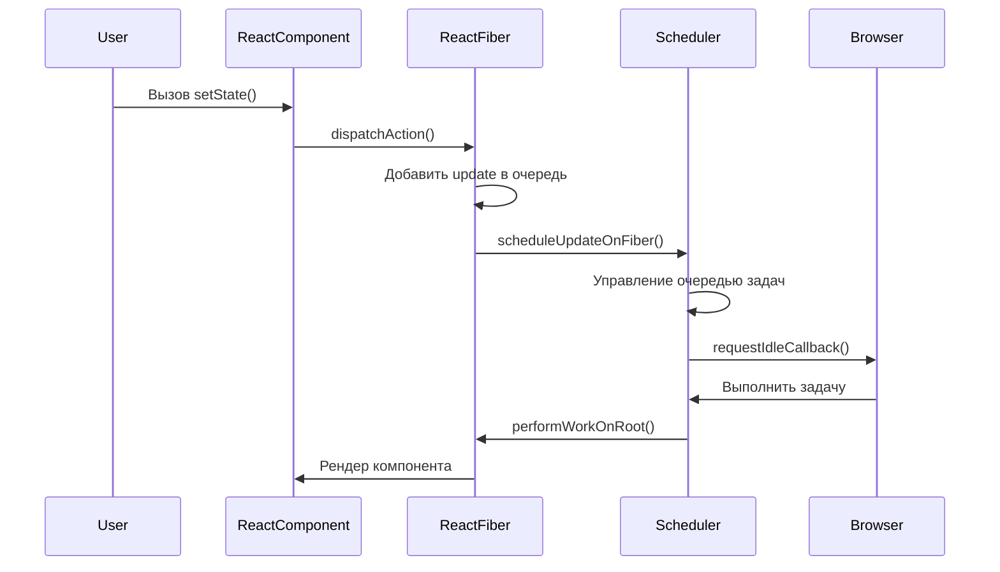

## 1 Updating your component’s state automatically queues a render.

Отличный вопрос! Понять, где именно в исходном коде React реализована "очередь рендеринга", довольно сложно, так как это не одна конкретная функция или файл, а скорее архитектурный подход, распределенный по нескольким модулям, особенно в рамках архитектуры **React Fiber**.

На основе поиска и понимания внутренних механизмов React, вот ключевые моменты и концепции, которые отвечают за эту "очередь":

1.  **Fiber Architecture и Work Loop:**

    - Сам принцип "очереди" и планирования рендеринга тесно связан с архитектурой React Fiber. Fiber (волокно) — это переосмысление ядра React, которое позволяет разбивать работу по рендерингу на более мелкие, прерываемые единицы.
    - Основная идея заключается в **"рабочем цикле" (work loop)**, который управляет обработкой этих единиц работы (Fiber nodes). Когда происходит обновление состояния (например, через `useState` или `setState`), React не сразу начинает рендеринг. Вместо этого он ставит задачу обновления в очередь для соответствующего Fiber-узла.
    - Этот рабочий цикл постоянно проверяет наличие задач в очереди и выполняет их, прерываясь, если браузеру необходимо выполнить более приоритетные задачи (например, обработать пользовательский ввод или анимацию).

2.  **Scheduler (Планировщик):**

    - React использует внутренний планировщик (находящийся в пакете `scheduler` в репозитории React) для управления приоритетами и очередями обновлений.
    - Когда вы вызываете `setState` или функцию обновления состояния (`setSomething`), планировщик React получает эту задачу. Он немедленно не запускает рендеринг, а помещает это обновление в очередь и решает, когда лучше всего его выполнить, чтобы не блокировать основной поток браузера и обеспечить плавный пользовательский интерфейс.
    - Планировщик может объединять (batching) несколько обновлений состояния, произошедших в одном событии (например, в одном обработчике клика), в один рендеринг, чтобы повысить производительность.

3.  **UpdateQueue (Очередь обновлений) на Fiber-узле:**
    - Каждый Fiber-узел (который представляет ваш компонент или DOM-элемент) имеет свою собственную внутреннюю "очередь обновлений" (`updateQueue`).
    - Когда вы вызываете `setState` (для классовых компонентов) или функцию обновления из `useState` (для функциональных компонентов), React добавляет это обновление в `updateQueue` соответствующего Fiber-узла.
    - На этапе рендеринга (когда React обрабатывает этот Fiber-узел), он проходит по `updateQueue`, применяет все ожидающие обновления состояния и вычисляет следующее состояние компонента.

**Где это искать в исходном коде (общие области):**

Вам нужно будет исследовать следующие пакеты в репозитории React:

- **`react-reconciler`:** Этот пакет содержит ядро алгоритма согласования (reconciliation), включая логику Fiber, рабочий цикл (`work loop`) и обработку Fiber-узлов. Именно здесь происходит основная работа по обработке очереди обновлений и построению нового Fiber-дерева.
- **`scheduler`:** Этот пакет отвечает за планирование работы, определение приоритетов и решение, когда выполнять те или иные обновления, используя такие API браузера, как `requestIdleCallback` (хотя в более новых версиях React может использоваться собственная реализация).
- **`react`:** Этот пакет содержит высокоуровневые API, такие как `useState` и `useEffect`. Вызовы этих функций в конечном итоге делегируются внутренней реализации, которая взаимодействует с `react-reconciler` для постановки обновлений в очередь.

**Итого:**

"Очередь рендеринга" в React — это не жесткая структура данных в одном месте, а концепция, реализованная через взаимодействие **архитектуры Fiber**, **планировщика** и **очередей обновлений на каждом Fiber-узле**. Это позволяет React эффективно управлять обновлениями UI, объединять их и приостанавливать/возобновлять работу, чтобы обеспечить высокую производительность и отзывчивость приложения.

Если вы хотите углубиться, начните с изучения пакетов `react-reconciler` и `scheduler` в исходном коде React. Это довольно сложная, но увлекательная область для изучения.

## 2

Реализация механизма очереди рендеринга при обновлении состояния находится в ядре React, в модуле **ReactFiberWorkLoop.js**. Вот ключевые части кода и их объяснение:

### 1. Место в исходном коде

Файл:  
`packages/react-reconciler/src/ReactFiberWorkLoop.js`  
(актуально для React 18+)

### 2. Ключевые функции

#### a) `dispatchAction()` (добавление в очередь)

**Путь**:  
`packages/react-reconciler/src/ReactFiberHooks.js` → `dispatchAction()`

```javascript
function dispatchAction<S, A>(
  fiber: Fiber,
  queue: UpdateQueue<S, A>,
  action: A
) {
  // Создание объекта обновления
  const update: Update<S, A> = {
    lane: requestUpdateLane(fiber),
    action,
    hasEagerState: false,
    eagerState: null,
    next: null,
  };

  // Добавление в очередь обновлений
  const pending = queue.pending;
  if (pending === null) {
    update.next = update;
  } else {
    update.next = pending.next;
    pending.next = update;
  }
  queue.pending = update;

  // Планирование работы
  scheduleUpdateOnFiber(fiber, update.lane);
}
```

#### b) `scheduleUpdateOnFiber()` (планирование рендера)

**Код**:

```javascript
export function scheduleUpdateOnFiber(fiber: Fiber, lane: Lane) {
  // Пометить Fiber-узел как нуждающийся в обновлении
  const root = markUpdateLaneFromFiberToRoot(fiber, lane);

  // Добавить корень в очередь рендеринга
  if (root !== null) {
    ensureRootIsScheduled(root, eventTime);
  }
}
```

#### c) `ensureRootIsScheduled()` (управление очередью)

**Ключевой фрагмент**:

```javascript
function ensureRootIsScheduled(root: FiberRoot) {
  // Проверка существующих задач
  const existingCallbackNode = root.callbackNode;

  // Создание новой задачи, если необходимо
  if (newCallbackPriority !== SyncLanePriority) {
    // Планирование асинхронного рендера
    root.callbackNode = scheduleCallback(
      schedulerPriorityLevel,
      performConcurrentWorkOnRoot.bind(null, root)
    );
  } else {
    // Синхронный рендер (срочные обновления)
    root.callbackNode = scheduleSyncCallback(
      performSyncWorkOnRoot.bind(null, root)
    );
  }
}
```

### 3. Как это работает

1. **Вызов `setState()`**:

   - Создает объект обновления (`update`)
   - Добавляет его в очередь компонента (`updateQueue`)

2. **Пометка компонента**:

   - React помечает Fiber-узел компонента как "грязный" (`dirtyComponent`)

3. **Планирование задачи**:

   - Обновления группируются по приоритетам (например, пользовательский ввод → высокий приоритет)
   - Задачи ставятся в очередь через `scheduler` (отдельный пакет React)

4. **Обработка очереди**:
   - Когда браузер готов (в `requestIdleCallback`), React выполняет `performSyncWorkOnRoot()` или `performConcurrentWorkOnRoot()`

### 4. Визуализация процесса



### 5. Где посмотреть в исходниках

1. Очередь обновлений:  
   `packages/react-reconciler/src/ReactUpdateQueue.js`

2. Планировщик:  
   `packages/scheduler/src/Scheduler.js`

3. Обработка Fiber-узлов:  
   `packages/react-reconciler/src/ReactFiberWorkLoop.js` → `workLoopSync()`

Ключевая идея: React **не рендерит компонент сразу** при вызове `setState()`, а добавляет обновление в очередь и обрабатывает его оптимальным способом (батчинг, приоритеты, прерываемый рендеринг).
